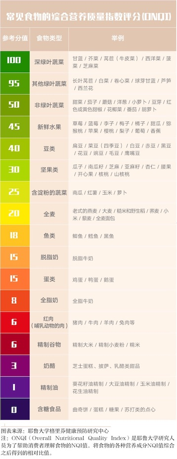

# 身体健康
> 对普通人来说，健康是最大的投资。 有车有房透支身体，老了一身病，这些人不会很幸福的。 得大病花钱如流水，辛苦一辈子因病返穷的人很多。 你就算没房子，只要身体健康，幸福指数也比他们高。  
> \- 半佛仙人

## 饮食
1. 饮食均衡。吃不同种类的食物。
2. 控制血糖选 **低GI** 的食物。低GI的食物有：全麦面包，燕麦，荞麦等粗粮。高GI的食物：面，米饭等精粮。先吃菜，再吃饭。
3. 选择营养质量指数 **NQI高** 的食物。比如深绿叶蔬菜。
4. 少吃油炸，反式脂肪酸，代可可脂的食物。
5. 压力控制。压力大容易暴饮暴食。

### GI(升糖指數)
> 升糖指數（GI）是指某种食物升高血糖效应与标准食品（通常为葡萄糖）升高血糖效应的比值，代表的是人体食用一定量的某种食物后会引起多大的血糖反应。

当GI值在55以下的为低GI食物；当GI值在55～70的为中GI食物；当GI值为70以上时的为高GI食物。

### 营养质量指数NQI
> NQI指 食物里所含营养素占供给量的比除以这个食物所含的热量占供给量的比。食物中的某营养素含量（蛋白质、矿物质、纤维素、维生素）越高，热量含量越低，NQI值就越高。

## 睡眠
有利于睡眠的方法：
1. 睡前一小时洗个热水澡或泡脚。较低的体温，有助于入睡。洗澡后，有利于体温下降。
2. 黑暗的环境。黑暗的环境有利于褪黑素的分泌。褪黑素有利于入睡。有褪黑素的药片。
3. 播放白噪音。白噪音是一些比较单调的声音。比如：风声，雨声。
4. 睡前半小时不要看电子屏幕，比如：手机，电视。电子屏幕释放的蓝光会抑制推黑素的分泌。
5. 睡前不做激烈运动。
6. 不做让人兴奋的事。
7. 睡前不吃夜宵。消化食物会影响睡眠。

## 运动
运动量。

优先练心肺功能。

